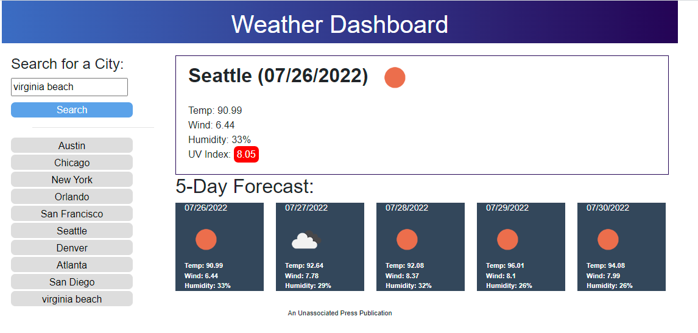

# WeatherChecker-challenge6

## My Work Day Scheduler
This was a great combination of prior learned and new material. I hope I did it right. I did not use LocalStorage for history. Was I supposed to?

I hope this works right!

## My links

Link to my GitHub:
https://github.com/digibrill/WeatherChecker-challenge6

Link to GitHub Challenge #2 page:
https://digibrill.github.io/WeatherChecker-challenge6/

---
© 2022 An Unassociated Press Publication
